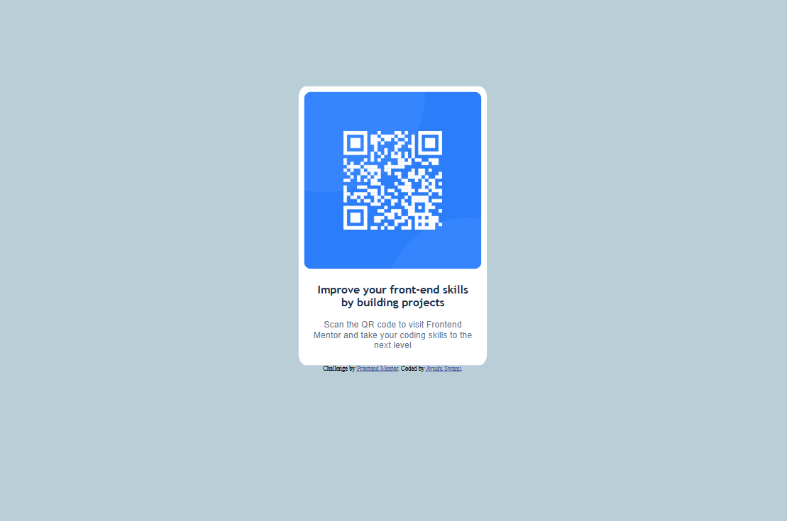

# Frontend Mentor - QR code component 

A responsive QR code component built using HTML and CSS as part of a Frontend Mentor challenge.  
This project focuses on layout design, spacing, and clean UI styling.

## Table of contents

- [Overview](#overview)
  - [Screenshot](#screenshot)
  - [Links](#links)
- [My process](#my-process)
  - [Built with](#built-with)
  - [What I learned](#what-i-learned)
  - [Continued development](#continued-development)
  - [AI Collaboration](#ai-collaboration)
- [Author](#author)

## Overview

### Screenshot

### Links

- Live Site URL: [Add live site URL here](https://your-live-site-url.com)

## My process

### Built with

- HTML5 (semantic markup)
- CSS3 (Flexbox, responsive styling)

### What I learned

- How to structure a clean and reusable UI component using HTML and CSS
- Centering elements effectively using modern CSS techniques
- Improving visual hierarchy through spacing, font sizes, and color contrast
- Translating a design reference into a functional web component

### Continued development

In future projects, I plan to:
- Explore more advanced CSS layouts using Grid
- Improve responsiveness across a wider range of screen sizes
- Focus on accessibility best practices
- Build more interactive components using JavaScript

### AI Collaboration

I used AI tools to support my learning and development process during this project.

- **Tools used:** ChatGPT  
- **How I used them:**  
  - Writing and refining the project README  

## Author

- Name: **Ayushi Swami**
- Frontend Mentor: https://www.frontendmentor.io/profile/Ayushi-171
- GitHub: https://github.com/Ayushi-171

